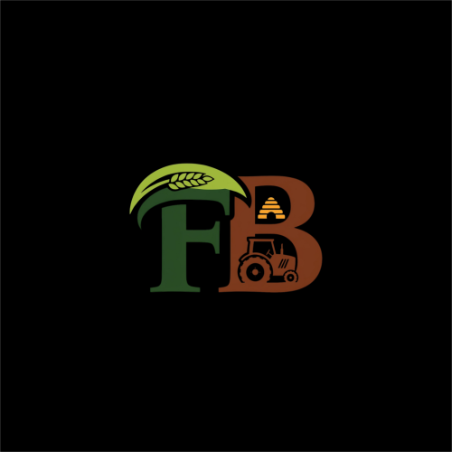
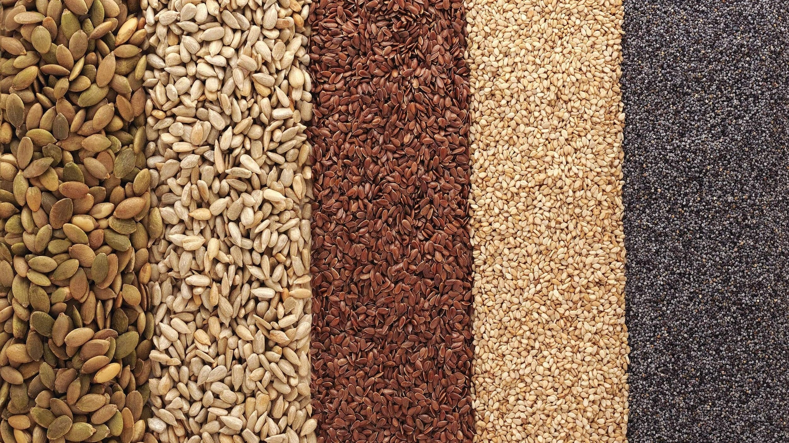

# FarmBasket - Seeds & Pesticide Management System

## Overview

**FarmBasket** is a modern, responsive web application designed as an e-commerce and supply chain management solution for the agricultural sector. The platform bridges the gap between farmers (customers), suppliers, and system administrators. 

Farmers can browse high-quality hybrid seeds and eco-friendly pesticides, add items to their cart, and proceed with a secure checkout. Suppliers can manage their inventory, list new products, and track order fulfillment. Administrators have access to overall system health, detailed sales analytics, revenue reports, and user directories.

A key architectural feature of **FarmBasket** is its hybrid offline-online capability: if the backend server is not running or if the app is hosted on static pages (such as GitHub Pages or Vercel), it automatically intercepts API calls and transitions to a localized browser database utilizing `localStorage`, ensuring zero downtime and fully functioning demos.

---

## Features

### 🌾 Customer Experience
*   **User Registration & Login:** Safe authentication to save customer profiles.
*   **Structured Catalog:** Dynamic browsing of products divided into **Seeds** and **Pesticides**.
*   **Detailed Product Insights:** Access to descriptions, benefits, and step-by-step usage instructions for every agricultural item.
*   **Cart & Checkout:** Add multiple items, adjust quantity levels, and check out using Cash on Delivery (COD).

### 🚜 Supplier Operations
*   **Supplier Authentication:** Dedicated portal for supplier registration and login.
*   **Inventory Control:** Add, update, or remove products (including title, pricing, quantity type, benefits list, and crop images).
*   **Order Fulfillment:** View real-time orders containing products they supply and update their statuses (*Pending*, *Processing*, *Delivered*).
*   **Performance Reports:** Supplier dashboard showing total sales, order metrics, and category distributions.

### 👑 Admin Control Panel
*   **System Analytics:** Complete business overview displaying total customer counts, supplier registrations, global product catalog size, and overall revenue.
*   **Sales Reports:** Breakdowns of overall sales revenue, order volumes, and top-performing products.
*   **User Directories:** Management lists to view and delete customer or supplier accounts.
*   **Inventory Auditing:** View the global list of seeds and pesticides in stock.

### 🌐 Hybrid Offline Mock Mode
*   **Zero-Dependency Execution:** Automatically switches to a localized `localStorage` mock database when offline, running on a static host, or when `VITE_OFFLINE_MODE=true`.
*   **Data Integrity:** Implements CRUD, order creation, state management, and updates product stock levels locally inside the browser.

---

## Tech Stack

*   **Frontend Framework:** React 19, React Router v7 (for robust multi-page client-side routing)
*   **Styling & UI:** Bootstrap 5.3.3 (responsive grid system, card components, alerts) & Custom Vanilla CSS (advanced micro-animations, glassmorphic elements, hover effects)
*   **HTTP Client:** Axios (featuring a custom request adapter to toggle between Express REST API and Local Storage mock API)
*   **Backend Runtime:** Node.js, Express.js (Express 5.1.0)
*   **Database ODM:** Mongoose 8.18.0 (MongoDB Atlas connection)
*   **Development Tools:** Vite (fast bundling and HMR), Nodemon (backend auto-restart)

---

## Dataset

The application database relies on five primary collection schemas defined using Mongoose:

### 1. Product Schema (`products`)
Stores the catalog details of all seeds and pesticides.
```javascript
{
  id: String,           // Unique product identifier (e.g., PROD001)
  product_name: String, // Name of the crop seed or pesticide
  type: String,         // Category: "Seeds" or "Pesticides"
  quantity: String,     // Packet/bottle size (e.g., "500g", "1L")
  price: Number,        // Unit price in local currency
  description: String,  // Overview of the product
  how_to_use: String,   // Step-by-step guidelines for farmers
  benefits: [String],   // Array of product advantages
  supplier_id: String,  // Reference ID of the supplying vendor
  status: String,       // Stock availability status
  stocks: Number,       // Quantities currently remaining in warehouse
  url: String           // Image URL representing the product
}
```

### 2. Order Schema (`orders`)
Captures transactions and customer delivery information.
```javascript
{
  order_id: String,     // Transaction ID (e.g., ORD001)
  customer: {
    name: String,
    email: String,
    phone: String,
    address: String,
    payment: String     // Payment mode chosen (e.g., "COD")
  },
  items: [
    { _id: String, product_name: String, price: Number, count: Number }
  ],
  total: Number,        // Total purchase amount
  date: Date,           // Timestamp of transaction (Defaults to Date.now)
  status: String,       // Status: "Pending" | "Processing" | "Delivered"
  sup_id: String        // ID of the main supplier associated with the items
}
```

### 3. Customer & CustMaster Schemas (`customers`, `custmaster`)
Stores client profiles (address, DOB) and their respective login credentials separately.

### 4. Supplier & SupMaster Schemas (`suppliers`, `supplier_master`)
Maintains registration information (contact numbers, company address, supply category) and corresponding authentication details.

---

## Installation

### Prerequisites
*   [Node.js](https://nodejs.org/) (v18 or higher recommended)
*   MongoDB local instance OR a MongoDB Atlas cloud database cluster

### Setup Steps

1.  **Clone the Repository:**
    ```bash
    git clone https://github.com/AzlanSindhi/seeds-pesticide.git
    cd seeds-pesticide
    ```

2.  **Install Dependencies:**
    Installs both frontend dependencies and backend dependencies in the root project folder:
    ```bash
    npm install
    ```

3.  **Environment Configuration:**
    Create a `.env` file in the root directory:
    ```env
    # MongoDB Connection URI (leave default to connect to cloud database)
    MONGODB_URI=mongodb+srv://<username>:<password>@cluster0.gzaqxub.mongodb.net/project?retryWrites=true&w=majority

    # Backend Server Port
    PORT=5000

    # Client API Base URL
    VITE_API_URL=http://localhost:5000

    # Force Offline Mock Mode (set to "true" to run frontend completely without Express/MongoDB)
    VITE_OFFLINE_MODE=false
    ```

4.  **Launch the Servers:**
    *   **To run the Node.js API server (Backend):**
        ```bash
        npm run server
        ```
    *   **To run the Vite dev server (Frontend):**
        ```bash
        npm run dev
        ```

---

## Usage

### 🧑‍🌾 Customer Access
Navigate to the root URL (usually `http://localhost:5173`). You can immediately browse products or register a new customer profile.
*   **Default Customer Login:** 
    *   *Email:* `ramesh@gmail.com`
    *   *Password:* `password`

### 💼 Supplier Dashboard
Navigate to `/supplier-module/login` or sign up as a new supplier.
*   **Default Supplier Logins:**
    *   *Green Growers Co. (Seeds):* `growers@gmail.com` / `password`
    *   *EcoAgro Protection (Pesticides):* `ecoagro@gmail.com` / `password`

### 👑 Administrator Console
Access the central control panel by visiting `/user/admin`.
*   **Admin Credentials:**
    *   *User ID:* `admin`
    *   *Password:* `1234`

---

## Results

*   **Dynamic Inventory Synchronization:** Purchasing products dynamically decrements the database stocks. Once stock levels reach zero, status updates to "Out of Stock" automatically.
*   **Low Stock Alerts:** Dashboard displays warn suppliers when specific items run low (e.g., Neem Oil Pest Spray has a threshold of less than 10 units).
*   **Real-time Revenue Calculations:** Total sales, total order counts, and category revenue are updated instantly on the dashboards upon successful checkouts.
*   **Reliable Mock Adaptability:** Demonstrates high responsiveness even under low-connectivity / static situations due to the local storage mock engine.

---

## Screenshots

*(Include UI screenshots here after deploying or running locally)*

| Homepage | Category Catalog |
|---|---|
|  |  |

*   **Admin Dashboard:** `/user/admin` showing sales metrics and customer tables.
*   **Supplier Control Panel:** Interface where suppliers list new products and handle order statuses.
*   **Checkout Screen:** Smooth checkout flow calculating summary and order validation.

---

## Future Improvements

*   **Payment Gateway Integration:** Incorporate Stripe, Razorpay, or PayPal API for real-time payments instead of mock COD.
*   **Smart Crop Advisor:** Suggest appropriate fertilizers and pesticides by evaluating crop types and local climate conditions.
*   **Interactive Chatbot:** Integration of a dialog bot to support farmers with crop growth techniques and dosage rates.
*   **Supplier Approval Flow:** Full validation mechanism for pending supplier accounts before they can publish listings.
*   **SMS & Email Notifications:** Automatic transactional message alerts to notify customers of status updates (e.g., "Shipped", "Delivered").

---

## Author

*   **Azlan Khan**
    *   GitHub: [@AzlanSindhi](https://github.com/AzlanSindhi)
    *   Email: [145383440+AzlanSindhi@users.noreply.github.com](mailto:145383440+AzlanSindhi@users.noreply.github.com)
